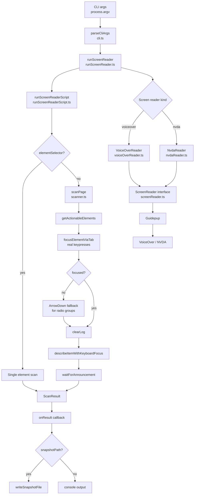

# Screen Reader Automation

Automated accessibility testing using real screen readers driven by [Playwright](https://playwright.dev/) and [Guidepup](https://www.guidepup.dev/). Tests run against **VoiceOver** on macOS and **NVDA** on Windows, capturing what a screen reader actually announces for each element on a page.

---

## Features

- **Real screen reader output** — drives VoiceOver and NVDA via genuine keyboard input, not simulated events, so announcements match what a real user hears
- **Single element or full page scanning** — target a specific element by CSS selector or walk every actionable element on the page
- **Snapshot baseline and diff** — save a baseline, make changes, capture current state, and compare to surface regressions
- **Cross-platform interface** — a shared `ScreenReader` interface means the same scanner logic runs on both macOS (VoiceOver) and Windows (NVDA)
- **Structured output** — results include the announced text, item text, DOM tag, role, type, and selector for each element
- **AI accessibility audit** — feed a snapshot to Claude or Gemini to generate a WCAG-referenced audit report (findings, severity, affected users, recommended fixes) as markdown

---

## Architecture



---

## Prerequisites

| Requirement     | macOS                 | Windows                                     |
| --------------- | --------------------- | ------------------------------------------- |
| Node.js         | 18+                   | 18+                                         |
| Screen reader   | VoiceOver (built-in)  | [NVDA](https://www.nvaccess.org/download/)  |
| Playwright      | Chromium              | Chromium                                    |
| Guidepup setup  | Required              | Required                                    |

Run Guidepup's environment setup tool before first use:

```bash
npx @guidepup/setup
```

> On macOS this grants Accessibility permissions to your terminal. On Windows it configures NVDA for automation. This only needs to be done once per machine.

---

## Installation

```bash
# Clone the repository
git clone <repo-url>
cd <repo-name>

# Install dependencies
npm install

# Install Playwright browsers
npx playwright install chromium
```

---

## Project Structure

```
├── snapshots/
│   ├── baseline.json       # Saved baseline snapshot
│   └── current.json        # Current snapshot for comparison
└── src/
    ├── core/
    │   ├── cli.ts                    # CLI argument parsing
    │   ├── getActionableElements.ts  # Finds focusable elements on the page
    │   ├── getElementInfo.ts         # Extracts tag, role, type, text from an element
    │   ├── models.ts                 # Shared TypeScript types
    │   ├── runScreenReader.ts        # Entry point — wires CLI args to script runner
    │   ├── runScreenReaderScript.ts  # Orchestrates browser + screen reader session
    │   ├── scanner.ts                # Page scanning loop with Tab/arrow navigation
    │   ├── screenReaderKinds.ts      # Maps kind string to config/label
    │   ├── screenReaderUtils.ts      # DOM info helpers
    │   ├── snapshotComparer.ts       # Diffs two snapshot files
    │   ├── snapshotWriter.ts         # Writes snapshot JSON to disk
    │   └── screenreaders/
    │       ├── screenReader.ts       # Shared ScreenReader interface
    │       ├── voiceOverReader.ts    # VoiceOver implementation (macOS)
    │       └── nvdaReader.ts         # NVDA implementation (Windows)
    ├── ai/
    │   ├── aiAnalyzer.ts             # Orchestrates the audit — reads snapshot, calls provider, writes report
    │   ├── aiProvider.ts             # Claude (streaming) and Gemini (JSON) API calls with retry
    │   ├── promptBuilder.ts          # Builds the accessibility-review prompt around the scan JSON
    │   ├── claude.ts                 # `ai:claude` entry point
    │   ├── gemini.ts                 # `ai:gemini` entry point
    │   ├── demoPrompt.ts             # Intro text shown via the typewriter effect
    │   └── terminalTyper.ts          # Typewriter-style terminal output
    ├── pages/
    │   └── test-page.html            # Sample test page
    └── scripts/
        ├── playwright-voiceover.ts   # VoiceOver entry point
        └── playwright-nvda.ts        # NVDA entry point
```

---

## Usage

### Serve the test page

The test page must be served over HTTP. Use the VS Code Live Server extension or any static file server:

```bash
npx serve src/pages
# page available at http://127.0.0.1:5500/src/pages/test-page.html
```

---

### Scan all actionable elements

Walks every focusable element on the page in Tab order and prints what the screen reader announces for each.

```bash
# VoiceOver (macOS)
npm run vo:pw

# NVDA (Windows)
npm run nvda:pw
```

**Example output:**

```json
{
  "selector": "input",
  "index": 0,
  "itemText": "Name (required), edit, focused, blank",
  "announced": "Name (required), edit, focused, blank",
  "screenReader": "NVDA",
  "domInfo": { "tag": "input", "role": null, "type": "text", "tabindex": null }
}
```

---

### Target a single element

Pass a CSS selector to focus and announce just that element.

```bash
# VoiceOver
npm run vo:element -- --element="#red"

# NVDA
npm run nvda:element -- --element="#red"
```

**Example output:**

```json
{
  "selector": "#red",
  "index": 0,
  "itemText": "Red, radio button, focused, not checked, 1 of 2",
  "announced": "Red, radio button, focused, not checked, 1 of 2",
  "screenReader": "NVDA",
  "domInfo": { "tag": "input", "role": null, "type": "radio", "tabindex": null }
}
```

---

### Save a baseline snapshot

Captures the current state of all elements and saves it as the reference snapshot.

```bash
# VoiceOver
npm run vo:snapshot:baseline

# NVDA
npm run nvda:snapshot:baseline
```

---

### Capture current state

After making changes to the page or component, capture a new snapshot to compare against the baseline.

```bash
# VoiceOver
npm run vo:snapshot:current

# NVDA
npm run nvda:snapshot:current
```

---

### Compare snapshots

Diffs the baseline and current snapshots and reports any differences in announced text.

```bash
# VoiceOver
npm run vo:compare -- ./snapshots/baseline.json ./snapshots/current.json

# NVDA
npm run nvda:compare -- ./snapshots/baseline.json ./snapshots/current.json
```

**Example diff output:**

```
══════════════════════════════════════════
 SNAPSHOT DIFF
  Baseline : ./snapshots/baseline.json  (2026-01-15T10:00:00.000Z)
  Current  : ./snapshots/current.json   (2026-01-15T11:00:00.000Z)
══════════════════════════════════════════

⚠  input[index=1]
   baseline : "Red, radio button, not checked, 1 of 2"
   current  : "Red, 1 of 2"

⚠️   1 difference(s) found.
```

---

### AI accessibility audit

Feed a snapshot JSON to an LLM to produce a WCAG-referenced audit report. Each finding includes what was observed, why it matters, who is affected, a WCAG success-criterion reference, a severity rating (Critical / High / Medium / Low), and a recommended fix.

Set the relevant API key in a `.env` file first:

```bash
# .env
ANTHROPIC_API_KEY=sk-ant-...   # for the Claude path
GEMINI_API_KEY=...             # for the Gemini path
```

Then run against a snapshot:

```bash
# Claude — streams the markdown report to the terminal as it is generated
npm run ai:claude -- ./snapshots/current.json

# Gemini — returns structured JSON, then renders it to markdown
npm run ai:gemini -- ./snapshots/current.json
```

Both paths save the report next to the snapshot as `<name>-claude-audit-report.md` or `<name>-gemini-audit-report.md`.

**Optional environment variables (Claude path):**

| Variable                         | Default                     | Purpose                             |
| -------------------------------- | --------------------------- | ----------------------------------- |
| `ANTHROPIC_API_KEY`              | —                           | API key (or `ANTHROPIC_AUTH_TOKEN`) |
| `ANTHROPIC_BASE_URL`             | `https://api.anthropic.com` | Override the API endpoint           |
| `ANTHROPIC_DEFAULT_SONNET_MODEL` | `claude-sonnet-4-6`         | Model to use                        |

---

## How It Works

### Why real keypresses instead of `element.focus()`

Screen readers maintain their own cursor position separate from DOM focus. A programmatic `element.focus()` call moves DOM focus but does not reliably notify the screen reader's accessibility layer — particularly NVDA on Windows, which requires keystrokes to go through the OS input pipeline to trigger mode switches and focus announcements.

This tool drives navigation using `reader.press("Tab")` routed through Guidepup, which sends real keystrokes that the screen reader sees and responds to exactly as a real user would.

### Radio button navigation

Radio buttons after the first in a group are not reachable via Tab — Tab only lands on the first radio in a group. Subsequent radios are navigated with `ArrowDown`. When Tab fails to reach an element after the maximum attempts, the scanner automatically falls back to re-focusing the previous element and pressing `ArrowDown` to move within the group.

### Announcement capture

After focus lands on each element the scanner:

1. Clears the spoken phrase log
2. Calls `reportCurrentFocus` (NVDA) or `DESCRIBE_ITEM_WITH_KEYBOARD_FOCUS` (VoiceOver) to trigger a clean re-announcement
3. Polls the spoken phrase log until it stabilises (debounce)
4. Filters out navigation context (landmarks, headings, groupings) to return only the element-specific announcement

---

## Known Limitations

- **macOS only for VoiceOver** — VoiceOver is built into macOS and cannot run on Windows
- **Windows only for NVDA** — NVDA is a Windows screen reader and cannot run on macOS
- **Headless mode unsupported** — screen readers require a visible browser window and a real display; headless Playwright is not compatible
- **Radio button side effect** — navigating to the second radio button in a group via `ArrowDown` selects it, which is native browser behaviour for radio groups and cannot be avoided
- **Tab order dependency** — the scanner walks elements in DOM Tab order; elements with custom `tabindex` values may be visited in a different order than expected
- **Single page** — the scanner operates on one URL per run; multi-page flows require multiple runs

---

## Snapshot Format

Snapshots are saved as JSON with a timestamp, URL, screen reader name, and an array of element results:

```json
{
  "timestamp": "2026-01-15T10:00:00.000Z",
  "url": "http://127.0.0.1:5500/src/pages/test-page.html",
  "screenReader": "NVDA",
  "mode": "actionable",
  "elements": [
    {
      "selector": "input",
      "index": 0,
      "itemText": "Name (required), edit, focused, blank",
      "announced": "Name (required), edit, focused, blank",
      "screenReader": "NVDA",
      "domInfo": {
        "tag": "input",
        "role": null,
        "type": "text",
        "tabindex": null
      }
    }
  ]
}
```

---

## Contributing

1. Fork the repository
2. Create a feature branch: `git checkout -b feature/my-change`
3. Commit your changes: `git commit -m 'Add my change'`
4. Push to the branch: `git push origin feature/my-change`
5. Open a pull request

Please test changes against both VoiceOver (macOS) and NVDA (Windows) before submitting.

---

## License

This project is licensed under the [Business Source License 1.1](LICENSE).
Commercial use requires explicit written permission from the author and copyright owner.
Contact jay.brass@gmail.com for more information.
